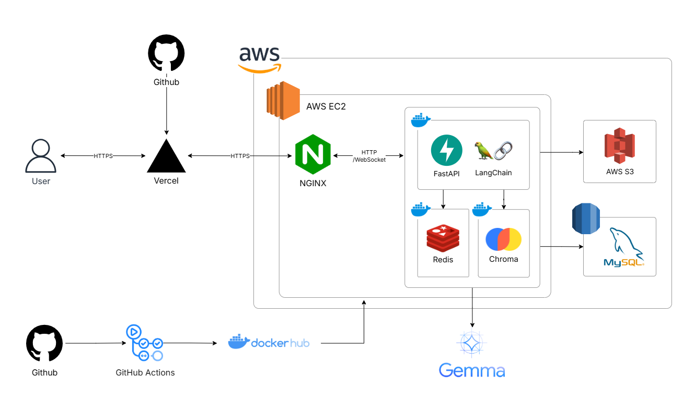

# BaPick - 운세 기반 맛집 추천 AI 채팅 플랫폼 🍀

> '오늘 뭐 먹지?' 매일 반복되는 고민, 이제 운세로 **재미있게, 나에게 딱 맞게** 해결하세요.  
> 운세와 취향을 바탕으로 메뉴부터 식당까지 Pick해드려요!

  

    
  

  
  **[🚀 서비스 바로가기](https://bapick.kr)** | **[📖 API 문서](https://bapick.duckdns.org/docs)** 
  

 

## 주요 기능
### 🔮 운세 기반 메뉴 추천
생년월일시를 기반으로 오행을 계산하고 오늘의 기운을 더해, 매일매일 달라지는 운세를 확인할 수 있습니다.
부족한 기운은 채우고, 과한 기운은 눌러주는 음식까지 함께 확인할 수 있습니다. 

   

 

### 💬 AI 채팅으로 메뉴 선택
AI 챗봇을 통해 오행에 맞춰 구체적인 메뉴를 추천받을 수 있습니다.

   

 

### 📍 위치 기반 식당 추천
메뉴를 결정한 이후 해당 메뉴를 판매하는 식당까지 바로 확인할 수 있습니다.
- 현재 위치 근처 추천이 기본, 원하면 사용자가 설정한 다른 위치도 가능
- RAG 기반 LLM을 사용해 정확한 식당 정보 제공
  

   

 

### ⭐ 식당 정보 확인 & 스크랩
마음에 드는 식당 정보를 바로 확인하고, 스크랩 기능을 통해 나중에 다시 찾아볼 수 있습니다.

   

 

### 👥 단체 채팅
친구나 동료들과 함께 채팅하며 메뉴와 식당을 한 번에 해결할 수 있습니다.

  

 

## 시스템 아키텍처
  

    
  

 

## 기술 스택
### Frontend

### Backend

### AI/ML

### Data Collection

### Database & Cache

### Infrastructure

 

## 팀원 소개
|이름|역할|
|:---|:---|
|권현진|FrontEnd|
|김재희|BackEnd|
|마디나보누|FrontEnd|
|방예진|BackEnd|
|유서현|BackEnd, Infra|
