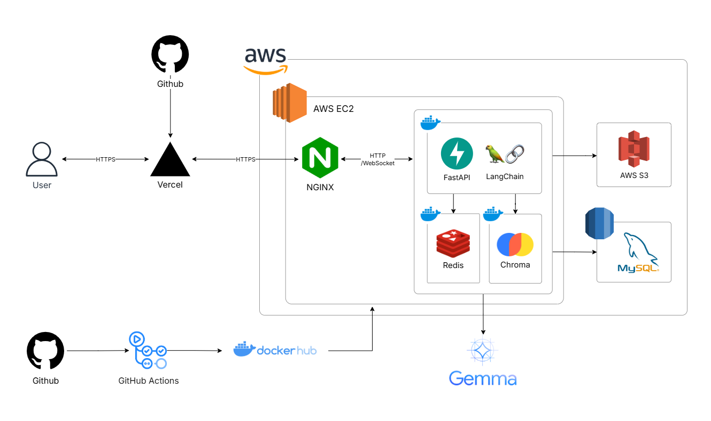

# Bapick - 운세 기반 맛집 추천 AI 채팅 플랫폼 🍀
> '오늘 뭐 먹지?' 매일 반복되는 고민, 이제 운세로 **재미있게, 나에게 딱 맞게** 해결하세요.  
> 오늘의 운세와 식성을 바탕으로 메뉴부터 식당까지 Pick해드려요!
> 

  

    
  

  
  **[🚀 서비스 바로가기](https://bapick.kr)** | **[📖 API 문서](https://api.bapick.kr/docs)** 
  

 

## 주요 기능
### 🔮 운세 기반 메뉴 추천
생년월일시를 기반으로 계산한 오행에 오늘의 일진을 반영해, 매일 달라지는 운세와 오행 균형을 확인할 수 있습니다. 부족한 기운을 보완하고 강한 기운을 조절하는 데 도움이 되는 음식도 함께 추천합니다.

홈 화면에서는 오늘의 포춘쿠키 버튼을 통해 오늘의 행운 메시지를 확인하고, 현재 위치 주변의 맛집도 함께 둘러볼 수 있습니다.

  

 

### 💬 AI 채팅으로 메뉴 선택
화면 하단 메뉴의 `+` 버튼을 통해 1:1 채팅, 단체 채팅, 기존 채팅방 목록으로 이동할 수 있습니다. 또한 어느 화면에서든 오른쪽 하단의 캐릭터 버튼을 눌러 1:1 AI 채팅을 바로 시작할 수 있습니다.

사용자의 오행과 대화 맥락을 바탕으로 AI 챗봇은 구체적인 메뉴를 추천합니다.

  

 

### 📍 위치 기반 식당 추천
메뉴를 선택하면 현재 위치 또는 사용자가 직접 설정한 위치를 기준으로, 해당 메뉴를 판매하는 주변 식당을 추천합니다.

  

 

### ⭐ 식당 정보 확인 & 스크랩
마음에 드는 식당의 상세 정보를 확인하고 스크랩할 수 있습니다. 스크랩한 식당은 컬렉션별로 분류해 나중에 다시 찾아볼 수 있습니다.

  

 

### 👥 단체 채팅
친구나 동료를 초대해 여러 사용자가 하나의 채팅방에서 메뉴와 식당을 함께 결정할 수 있습니다. 단체 채팅방에서는 `@밥풀이`를 멘션해 필요한 순간에만 메뉴와 식당을 추천받을 수 있습니다.

 

 

이외에도 친구 추가, 스크랩 컬렉션 관리, 식당 방문 일정을 캘린더에 기록하는 기능을 제공합니다.
 

## 시스템 아키텍처
  

    
  

 

## 기술 스택

### Frontend

### Backend

### AI/ML

### Data Collection

### Database & Cache

### Storage

### Infrastructure

 

## 팀원 소개
|이름|역할|
|:---|:---|
|권현진|FrontEnd|
|김재희|BackEnd|
|마디나보누|FrontEnd|
|방예진|BackEnd|
|유서현|BackEnd, Infra|
